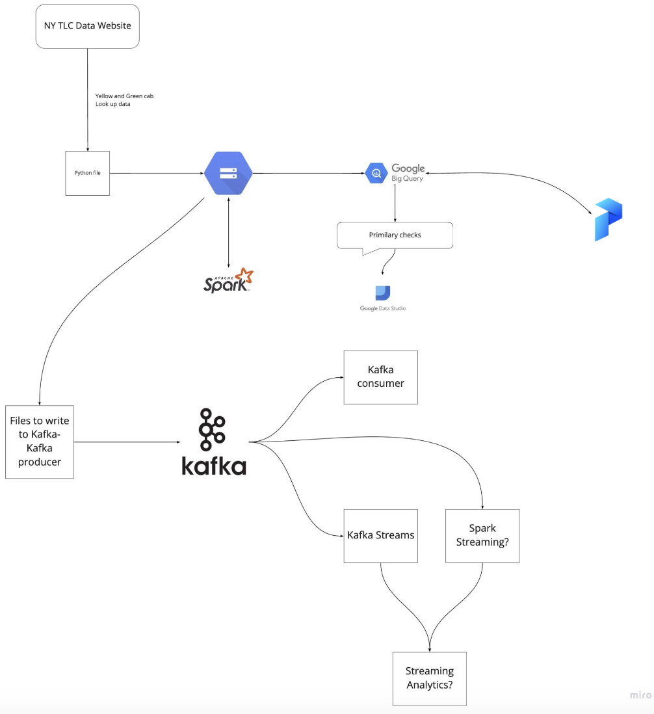

# DE-Zoomcamp
Portfolio project, Inspired by the Data Engineering Zoomcamp course:
[https://github.com/DataTalksClub/data-engineering-zoomcamp]

## Repo Structure
The repository is divided into smaller parts (weeks) which include learning/training and final project:
1. Basics and setups required for the rest of the projects
    * Docker & SQL
    * Terraform & OCI (In Zoomcamp they used GCP, but as I use GCP in my everyday work, I decided to experiment with another free cloud provider like Oracle)

2. tbd

### [Week 1: Introduction & Prerequisites](week_1_basics)

* Configuring OCI
* Docker and docker-compose
* Running Postgres locally with Docker
* Setting up infrastructure on OCI with Terraform (testing Terraform)
* Preparing the environment for the next steps
* Homework?

[More details](week_1_basics)

/* TBD */
### [Week 2: Workflow Orchestration](week_2_workflow_orchestration/)

* Data Lake
* Workflow orchestration
* Introduction to Prefect
* ETL with GCP & Prefect
* Parametrizing workflows
* Prefect Cloud and additional resources
* Homework

[More details](week_2_workflow_orchestration/)

### [Week 3: Data Warehouse](week_3_data_warehouse)

* Data Warehouse
* BigQuery
* Partitioning and clustering
* BigQuery best practices
* Internals of BigQuery
* Integrating BigQuery with Airflow
* BigQuery Machine Learning

[More details](week_3_data_warehouse)

### [Week 4: Analytics engineering](week_4_analytics_engineering/)

* Basics of analytics engineering
* dbt (data build tool)
* BigQuery and dbt
* Postgres and dbt
* dbt models
* Testing and documenting
* Deployment to the cloud and locally
* Visualizing the data with google data studio and metabase

[More details](week_4_analytics_engineering)

### [Week 5: Batch processing](week_5_batch_processing)

* Batch processing
* What is Spark
* Spark Dataframes
* Spark SQL
* Internals: GroupBy and joins

[More details](week_5_batch_processing)

### [Week 6: Streaming](week_6_stream_processing)

* Introduction to Kafka
* Schemas (avro)
* Kafka Streams
* Kafka Connect and KSQL

[More details](week_6_stream_processing)

### [Week 7, 8 & 9: Project](week_7_project)

Putting everything we learned to practice

* Week 7 and 8: working on your project
* Week 9: reviewing your peers

[More details](week_7_project)

## Overview

### Architecture diagram
Image copied from Zoomcamp project
* Note that instead of Google Cloud tools like object storage and DWH we use OCI

### Technologies
* *Oracle Cloud Infrastructure (OCI)*:
  * *File Storage (Bucket)*: Data Lake
  * *Autonomous Data Warehouse (ADWH)*: Data Warehouse
* *Terraform*: Infrastructure-as-Code (IaC)
* *Docker*: Containerization
* *SQL*: Data Analysis & Exploration
* *Prefect*: Workflow Orchestration??
* *dbt*: Data Transformation??
* *Spark*: Distributed Processing??
* *Kafka*: Streaming
